# BARQ Fleet Management - Database Relationship Diagrams

This document contains visual diagrams of the database relationships using Mermaid syntax.
You can render these in GitHub, Notion, or any Mermaid-compatible viewer.

---

## Core System Architecture


---

## Fleet Management Domain

```mermaid
graph TB
    subgraph "Core Entities"
        COURIER[Couriers<br/>---<br/>barq_id<br/>employee_id<br/>status]
        VEHICLE[Vehicles<br/>---<br/>plate_number<br/>status<br/>type]
    end

    subgraph "Assignments"
        ASSIGN[CourierVehicleAssignments<br/>---<br/>status<br/>start_date<br/>end_date]

        COURIER -->|many-to-many| ASSIGN
        VEHICLE -->|many-to-many| ASSIGN
    end

    subgraph "Vehicle Operations"
        MAINT[VehicleMaintenance<br/>---<br/>type<br/>status<br/>cost]
        INSPECT[VehicleInspections<br/>---<br/>type<br/>status<br/>score]
        ACCIDENT[AccidentLogs<br/>---<br/>severity<br/>cost<br/>status]
        VLOG[VehicleLogs<br/>---<br/>mileage<br/>distance<br/>fuel]
        FUEL[FuelLogs<br/>---<br/>quantity<br/>cost<br/>date]

        VEHICLE -->|1:many| MAINT
        VEHICLE -->|1:many| INSPECT
        VEHICLE -->|1:many| ACCIDENT
        VEHICLE -->|1:many| VLOG
        VEHICLE -->|1:many| FUEL

        COURIER -.optional.-> ACCIDENT
        COURIER -.optional.-> VLOG
        COURIER -.optional.-> FUEL
    end

    subgraph "Documents"
        DOC[Documents<br/>---<br/>entity_type<br/>entity_id<br/>⚠️ NO FK!]

        DOC -.polymorphic.-> COURIER
        DOC -.polymorphic.-> VEHICLE
    end

    style ASSIGN fill:#fff3e0
    style ACCIDENT fill:#ffebee
    style DOC fill:#ffcdd2
```



### ⚠️ Critical Issues in Fleet Domain

1. **Circular Reference:**
   - `Courier.current_vehicle_id` → `Vehicle`
   - `CourierVehicleAssignment` also tracks this
   - **Two sources of truth!**

2. **Document Model:**
   - Polymorphic reference (entity_type + entity_id)
   - **No foreign key constraint**
   - Can point to non-existent records

3. **Missing ondelete:**
   - `FuelLog.courier_id` - no ondelete specified

---

## HR Management Domain

```mermaid
graph TB
    COURIER[Couriers]

    subgraph "Compensation"
        SALARY[Salaries<br/>---<br/>month/year<br/>⚠️ No unique constraint<br/>⚠️ No ondelete]
        BONUS[Bonuses<br/>---<br/>type<br/>amount<br/>⚠️ No ondelete]
        LOAN[Loans<br/>---<br/>amount<br/>balance<br/>⚠️ No ondelete]
    end

    subgraph "Time & Attendance"
        ATT[Attendance<br/>---<br/>date<br/>status<br/>⚠️ No unique constraint<br/>⚠️ No ondelete]
        LEAVE[Leaves<br/>---<br/>type<br/>status<br/>days<br/>⚠️ No ondelete]
    end

    subgraph "Assets"
        ASSET[Assets<br/>---<br/>type<br/>status<br/>⚠️ No ondelete]
    end

    COURIER -->|1:many| SALARY
    COURIER -->|1:many| BONUS
    COURIER -->|1:many| LOAN
    COURIER -->|1:many| ATT
    COURIER -->|1:many| LEAVE
    COURIER -->|1:many| ASSET

    USER[Users] -.approver.-> LOAN
    USER -.approver.-> LEAVE
    USER -.approver.-> BONUS

    style SALARY fill:#ffcdd2
    style BONUS fill:#ffcdd2
    style LOAN fill:#ffcdd2
    style ATT fill:#ffcdd2
    style LEAVE fill:#ffcdd2
    style ASSET fill:#ffcdd2
```



### ⚠️ Critical Issues in HR Domain

**ALL HR models are missing:**
1. `ondelete` behavior on `courier_id` FK
2. Proper cascade/restrict strategies
3. **Result:** Cannot delete couriers with any HR records

**Missing Unique Constraints:**
- `Salary`: Can have duplicate records for same courier/month
- `Attendance`: Can have duplicate records for same courier/date

---

## Accommodation Domain

```mermaid
graph TB
    COURIER[Couriers<br/>---<br/>❌ accommodation_building_id<br/>❌ accommodation_room_id<br/><i>Orphaned columns!</i>]

    subgraph "Proper Hierarchy"
        BUILD[Buildings<br/>---<br/>name<br/>total_capacity]
        ROOM[Rooms<br/>---<br/>room_number<br/>capacity<br/>⚠️ No ondelete]
        BED[Beds<br/>---<br/>bed_number<br/>status<br/>⚠️ No ondelete]
        ALLOC[Allocations<br/>---<br/>allocation_date<br/>release_date<br/>⚠️ No ondelete]
    end

    BUILD -->|1:many| ROOM
    ROOM -->|1:many| BED
    BED -->|1:1| ALLOC
    COURIER -->|1:many| ALLOC

    COURIER -.broken refs.-> BUILD
    COURIER -.broken refs.-> ROOM

    style COURIER fill:#ffcdd2
    style ROOM fill:#fff9c4
    style BED fill:#fff9c4
    style ALLOC fill:#fff9c4
```



### ⚠️ Critical Issues in Accommodation

1. **Orphaned Columns:**
   - `Courier.accommodation_building_id` - No FK constraint
   - `Courier.accommodation_room_id` - No FK constraint
   - **Should be removed** - use Allocation table

2. **Missing Cascade Chain:**
   - Delete Building → Rooms not cascade deleted
   - Delete Room → Beds not cascade deleted
   - Delete Bed → Allocations not cascade deleted
   - **All need CASCADE ondelete**

---

## Operations Domain

```mermaid
graph TB
    COURIER[Couriers]
    VEHICLE[Vehicles]

    subgraph "Route Planning"
        ZONE[Zones<br/>---<br/>zone_code<br/>boundaries<br/>status]
        ROUTE[Routes<br/>---<br/>route_number<br/>status<br/>date]

        ZONE -->|1:many| ROUTE
        COURIER -.assigned.-> ROUTE
    end

    subgraph "Deliveries"
        DELIV[Deliveries<br/>---<br/>tracking_number<br/>status<br/>⚠️ cod_amount: Integer!<br/>⚠️ No ondelete]
        COD[COD Transactions<br/>---<br/>amount: Numeric(10,2)<br/>status<br/>⚠️ No ondelete]

        COURIER -->|1:many| DELIV
        COURIER -->|1:many| COD
    end

    subgraph "Issues"
        INC[Incidents<br/>---<br/>type<br/>status<br/>⚠️ cost: Integer!<br/>⚠️ No ondelete]

        COURIER -.optional.-> INC
        VEHICLE -.optional.-> INC
    end

    style DELIV fill:#ffcdd2
    style COD fill:#ffcdd2
    style INC fill:#ffcdd2
```

### ⚠️ Critical Issues in Operations

1. **Type Inconsistencies:**
   - `Delivery.cod_amount`: Integer (loses decimals)
   - `COD.amount`: Numeric(10,2) (correct)
   - `Incident.cost`: Integer (should be Numeric)

2. **Missing ondelete:**
   - `Delivery.courier_id` - nullable=False, no ondelete
   - `COD.courier_id` - nullable=False, no ondelete
   - `Incident.courier_id` and `vehicle_id` - no ondelete

---

## Support Domain

```mermaid
graph TB
    USER[Users]
    COURIER[Couriers]

    subgraph "Ticket System"
        TICKET[Tickets<br/>---<br/>ticket_id<br/>status<br/>priority<br/>⚠️ created_by: nullable=False + ondelete=SET NULL]
        REPLY[TicketReplies<br/>---<br/>message<br/>⚠️ is_internal: Integer!<br/>⚠️ user_id: nullable=False + ondelete=SET NULL]
        ATTACH[TicketAttachments<br/>---<br/>filename<br/>file_size<br/>⚠️ uploaded_by: nullable=False + ondelete=SET NULL]
        TEMPLATE[TicketTemplates<br/>---<br/>name<br/>default_category]
    end

    COURIER -.optional.-> TICKET
    USER -->|creator| TICKET
    USER -.assignee.-> TICKET
    USER -.escalator.-> TICKET

    TICKET -->|1:many| REPLY
    TICKET -->|1:many| ATTACH
    TEMPLATE -.used by.-> TICKET

    USER -->|author| REPLY
    REPLY -->|1:many| ATTACH
    USER -->|uploader| ATTACH

    TICKET -.merged into.-> TICKET

    style TICKET fill:#fff9c4
    style REPLY fill:#ffcdd2
    style ATTACH fill:#ffcdd2
```



### ⚠️ Critical Issues in Support

**Conflicting Constraints:**
All have `nullable=False` with `ondelete=SET NULL` - **IMPOSSIBLE!**

1. `Ticket.created_by`:
   - Column is NOT NULL
   - FK has ondelete=SET NULL
   - **Cannot SET NULL on NOT NULL column**

2. `TicketReply.user_id`: Same issue

3. `TicketAttachment.uploaded_by`: Same issue

**Type Issues:**
- `TicketReply.is_internal`: Integer (should be Boolean)

---

## Relationship Summary by Type

### CASCADE Delete (Proper Cleanup)


### SET NULL (Preserve Historical Data)


### RESTRICT (Protect Critical Data)


### ⚠️ Missing ondelete (BROKEN)


---

## Multi-Tenant Architecture


### Multi-Tenant Query Pattern

**Every query must filter by organization_id:**

```sql
-- CORRECT:
SELECT * FROM couriers
WHERE organization_id = :current_org_id
  AND status = 'ACTIVE';

-- WRONG (will see other orgs' data):
SELECT * FROM couriers
WHERE status = 'ACTIVE';
```

**Missing Composite Indexes:**
```sql
-- Needed in ALL tenant-aware tables:
CREATE INDEX ix_couriers_org_created
ON couriers(organization_id, created_at);

CREATE INDEX ix_vehicles_org_created
ON vehicles(organization_id, created_at);

-- etc.
```

---

## Data Flow Diagrams

### Courier Lifecycle


### Vehicle Lifecycle

```mermaid
stateDiagram-v2
    [*] --> Active
    Active --> Maintenance: Schedule Service
    Maintenance --> Active: Service Complete
    Active --> Repair: Breakdown/Accident
    Repair --> Active: Repair Complete
    Active --> Inactive: Temporary Stop
    Inactive --> Active: Reactivate
    Active --> Retired: End of Life
    Retired --> [*]

    note right of Active
        Generates:
        - Vehicle Logs
        - Fuel Logs
        - Inspections
    end note

    note right of Repair
        Creates:
        - Accident Log
        - Maintenance Record
    end note

    note right of Retired
        ✅ CAN DELETE:
        - Cascades all logs
        - Sets NULL current assignments
    end note
```



---

## Index Strategy Visualization

### Before Optimization (Slow)


### After Optimization (Fast)

```mermaid
graph LR
    Q1[Query: Get active assignments<br/>for courier] --> IDX1[Index Scan<br/>ix_assignment_courier_status<br/>~5ms ✓]
    Q2[Query: Get courier's<br/>salary for month] --> IDX2[Index Scan<br/>ix_salary_courier_period<br/>~3ms ✓]
    Q3[Query: Get vehicle<br/>maintenance history] --> IDX3[Index Scan<br/>ix_maintenance_vehicle_status<br/>~4ms ✓]

    style IDX1 fill:#c8e6c9
    style IDX2 fill:#c8e6c9
    style IDX3 fill:#c8e6c9
```



---

## Testing Strategy

### Delete Cascade Testing

```mermaid
graph TB
    subgraph "Test: Delete Courier"
        START[Create Test Courier] --> ADD1[Add Leaves]
        ADD1 --> ADD2[Add Attendance]
        ADD2 --> ADD3[Add Vehicle Assignment]
        ADD3 --> ADD4[Add Deliveries]
        ADD4 --> ADD5[Add Salary]
        ADD5 --> DELETE[DELETE Courier]

        DELETE --> CHECK1{Leaves Deleted?}
        CHECK1 -->|YES| CHECK2{Attendance Deleted?}
        CHECK2 -->|YES| CHECK3{Assignments Deleted?}
        CHECK3 -->|YES| CHECK4{Deliveries.courier_id = NULL?}
        CHECK4 -->|YES| CHECK5{Salary Prevents Delete?}
        CHECK5 -->|YES| PASS[✓ Test Pass]
        CHECK5 -->|NO| FAIL[✗ Test Fail]
        CHECK1 -->|NO| FAIL
        CHECK2 -->|NO| FAIL
        CHECK3 -->|NO| FAIL
        CHECK4 -->|NO| FAIL
    end

    style PASS fill:#c8e6c9
    style FAIL fill:#ffcdd2
```



---

## Summary: Relationship Health

| Domain | Total Models | ✅ Good | ⚠️ Issues | 🔴 Critical |
|--------|--------------|---------|-----------|-------------|
| **Core** | 8 | 6 | 1 | 1 |
| **Fleet** | 9 | 3 | 2 | 4 |
| **HR** | 6 | 0 | 0 | 6 |
| **Accommodation** | 4 | 1 | 0 | 3 |
| **Operations** | 6 | 2 | 0 | 4 |
| **Support** | 6 | 2 | 1 | 3 |
| **TOTAL** | 39 | 14 (36%) | 4 (10%) | 21 (54%) |

**Critical Issue Breakdown:**
- Missing `ondelete`: 17 tables (44%)
- Missing FK constraints: 1 table (2%)
- Circular references: 1 pair (3%)
- Type inconsistencies: 3 columns (2%)
- Conflicting constraints: 3 tables (8%)

---

**Report Generated:** 2025-12-07
**Database Architect:** AI Agent
**Rendering:** Compatible with GitHub, Notion, Mermaid Live Editor
